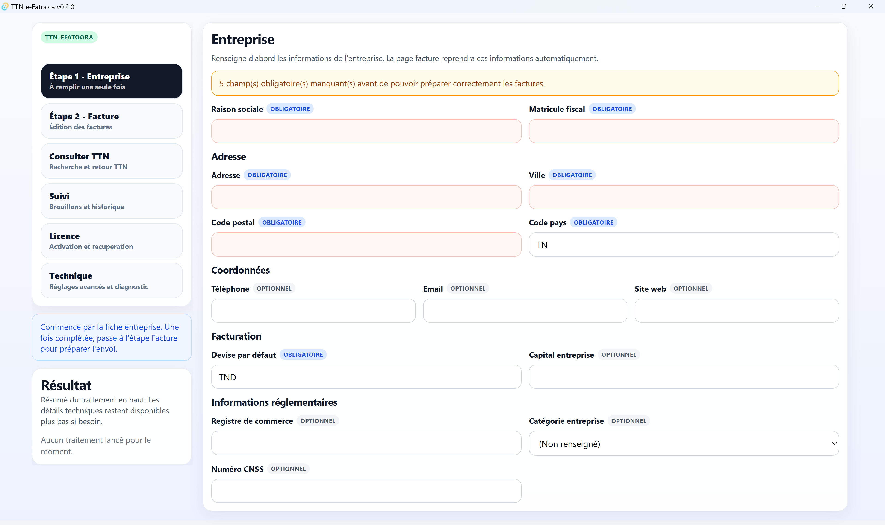
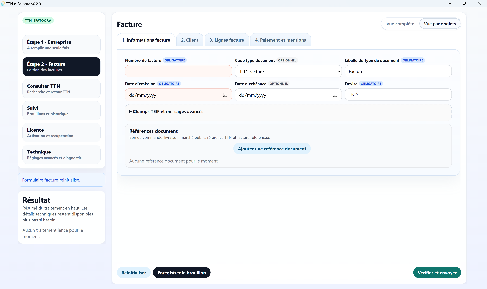

  

# TTN e-Fatoora

Application desktop locale pour générer, signer et envoyer des factures électroniques TTN en quelques minutes — sans dépendance cloud.

---

## 🚀 Télécharger

👉 [Télécharger la dernière version](https://github.com/Ifriqa/ttn-efatoora/releases/latest/download/TTN-eFatoora_stable.exe)

---

## ✨ Fonctionnalités

- Génération de factures au format TEIF (XML)
- Signature avec certificat USB (TunTrust)
- Envoi direct vers TTN
- Fonctionnement local (aucune dépendance cloud)
- Utilisable hors ligne
- Workflow simple en étapes

---

## 🖥️ Captures d’écran

### 📄 Création de facture

### 🏢 Fiche entreprise

---

## ⚙️ Fonctionnement

1. Renseigner les informations de l’entreprise (une seule fois)
2. Créer la facture
3. Signer avec la clé USB
4. Envoyer vers TTN

---

## 🎯 Pour qui ?

- Entreprises tunisiennes utilisant TTN
- Comptables et fiduciaires
- Toute structure souhaitant une solution locale et sécurisée

---

## 🔐 Pourquoi Ifriqa ?

- Les données restent sur votre machine
- Aucun cloud intermédiaire
- Intégration directe avec TTN
- Contrôle total sur vos factures

---

## 🧱 Architecture

- Application desktop (Tauri)
- Traitement local
- Communication directe avec TTN
- Aucun backend externe requis

---

## 📦 Contenu des releases

Chaque version contient :

- `.exe` → application
- `.sig` → signature de sécurité
- `latest.json` → métadonnées pour mise à jour automatique

---

## ⚠️ Prérequis

- Windows
- Certificat USB TunTrust (signature)
- Compte TTN actif

---

## 🛠️ État du projet

Version initiale prête à l’usage.  
Améliorations en cours.

---

## 🏢 À propos d’Ifriqa

Ifriqa développe des outils de conformité et d’automatisation :

- Facturation électronique
- Applications locales (local-first)
- Outils de contrôle et d’audit

---
